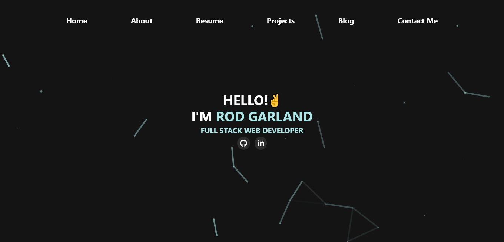

<!-- PROJECT LOGO -->
<br />
<div align="center">

---

<h3 align="center">Personal Portfolio v2</h3>

  <p align="center">
   Personal Portfolio for <a href="https://github.com/zencoder24">Rodderick Garland</a>
    <br />
    <br />
    <a href="https://www.rodthedev.com">Live Site</a>
    ·
    <a href="https://github.com/zencoder24/personal-portfolio/issues">Report Bug</a>
    ·
    <a href="https://github.com/zencoder24/personal-portfolio/issues">Request Feature</a>
  </p>
</div>

---

<br />

<!-- TABLE OF CONTENTS -->
<details>
  <summary>Table of Contents</summary>
  <ol>
    <li>
      <a href="#about-the-project">About The Project</a>
      <ul>
        <li><a href="#features">Features</a></li>
        <li><a href="#built-with">Built With</a></li>
      </ul>
    </li>
    <li>
      <a href="#getting-started">Getting Started</a>
      <ul>
        <li><a href="#prerequisites">Prerequisites</a></li>
        <li><a href="#installation">Installation</a></li>
      </ul>
    </li>
    <li><a href="#usage">Usage</a></li>
    <li><a href="#show-your-support">Show Your Support</a></li>
  </ol>
</details>

<!-- ABOUT THE PROJECT -->

## About This Project

## 

**This is a personal portfolio website for Rodderick Garland. This site features a blog, a list of skills and projects I have created, and a way to contact.**

<p align="right">(<a href="#readme-top">back to top</a>)</p>

## Features

**📱 Uses Sanity.io for content managment**

**📖 Full-featured Blog Page**

**🎨 Styled with Tailwind CSS and Framer Motion**

**📖 Formik/Yup Form Handling**

<p align="right">(<a href="#readme-top">back to top</a>)</p>

### Built With


 - [Next 13](https://beta.nextjs.org/docs)
 - [Sanity](https://www.sanity.io/)
 - [Tailwind](https://tailwindcss.com/)
 - [React Three Fiber](https://docs.pmnd.rs/react-three-fiber/getting-started/introduction)
 


<p align="right">(<a href="#readme-top">back to top</a>)</p>

<!-- GETTING STARTED -->

## Getting Started

To get a local copy up and running follow these simple example steps.

### Prerequisites

Download the latest version of the Node Package Manager

- npm
  ```sh
  npm install npm@latest -g
  ```

### Installation

1. Clone the repo
   ```sh
   git clone https://github.com/zencoder24/personal-portfolio
   ```
2. Install NPM packages
   ```sh
   npm install
   ```
3. Change Directory in to the personal-portfolio folder
   ```sh
   cd personal-portfolio
   ```
4. Run on Local Server
   ```sh
   npm run dev
   ```

Runs the app in the development mode.

Open http://localhost:3000 to view it in the browser. The page will reload if you make edits.

<p align="right">(<a href="#readme-top">back to top</a>)</p>

<!-- USAGE EXAMPLES -->

## Usage

Open the project folder and Navigate to `/app` directory. <br/>
You will find all the components and pages used and you can edit your information accordingly.

<p align="right">(<a href="#readme-top">back to top</a>)</p>

### Show your support

Give a ⭐ if you like this website!

<p align="right">(<a href="#readme-top">back to top</a>)</p>

<!-- MARKDOWN LINKS & IMAGES -->
<!-- https://www.markdownguide.org/basic-syntax/#reference-style-links -->

[contributors-shield]: https://img.shields.io/github/contributors/github_username/repo_name.svg?style=for-the-badge
[contributors-url]: https://github.com/github_username/repo_name/graphs/contributors
[forks-shield]: https://img.shields.io/github/forks/github_username/repo_name.svg?style=for-the-badge
[forks-url]: https://github.com/github_username/repo_name/network/members
[stars-shield]: https://img.shields.io/github/stars/github_username/repo_name.svg?style=for-the-badge
[stars-url]: https://github.com/github_username/repo_name/stargazers
[issues-shield]: https://img.shields.io/github/issues/github_username/repo_name.svg?style=for-the-badge
[issues-url]: https://github.com/github_username/repo_name/issues
[license-shield]: https://img.shields.io/github/license/github_username/repo_name.svg?style=for-the-badge
[license-url]: https://github.com/github_username/repo_name/blob/master/LICENSE.txt
[linkedin-shield]: https://img.shields.io/badge/-LinkedIn-black.svg?style=for-the-badge&logo=linkedin&colorB=555
[linkedin-url]: https://linkedin.com/in/linkedin_username
[product-screenshot]: images/screenshot.png
[next.js]: https://img.shields.io/badge/next.js-000000?style=for-the-badge&logo=nextdotjs&logoColor=white
[next-url]: https://nextjs.org/
[react.js]: https://img.shields.io/badge/React-20232A?style=for-the-badge&logo=react&logoColor=61DAFB
[react-url]: https://reactjs.org/
[vue.js]: https://img.shields.io/badge/Vue.js-35495E?style=for-the-badge&logo=vuedotjs&logoColor=4FC08D
[vue-url]: https://vuejs.org/
[angular.io]: https://img.shields.io/badge/Angular-DD0031?style=for-the-badge&logo=angular&logoColor=white
[angular-url]: https://angular.io/
[svelte.dev]: https://img.shields.io/badge/Svelte-4A4A55?style=for-the-badge&logo=svelte&logoColor=FF3E00
[svelte-url]: https://svelte.dev/
[laravel.com]: https://img.shields.io/badge/Laravel-FF2D20?style=for-the-badge&logo=laravel&logoColor=white
[laravel-url]: https://laravel.com
[bootstrap.com]: https://img.shields.io/badge/Bootstrap-563D7C?style=for-the-badge&logo=bootstrap&logoColor=white
[bootstrap-url]: https://getbootstrap.com
[jquery.com]: https://img.shields.io/badge/jQuery-0769AD?style=for-the-badge&logo=jquery&logoColor=white
[jquery-url]: https://jquery.com
